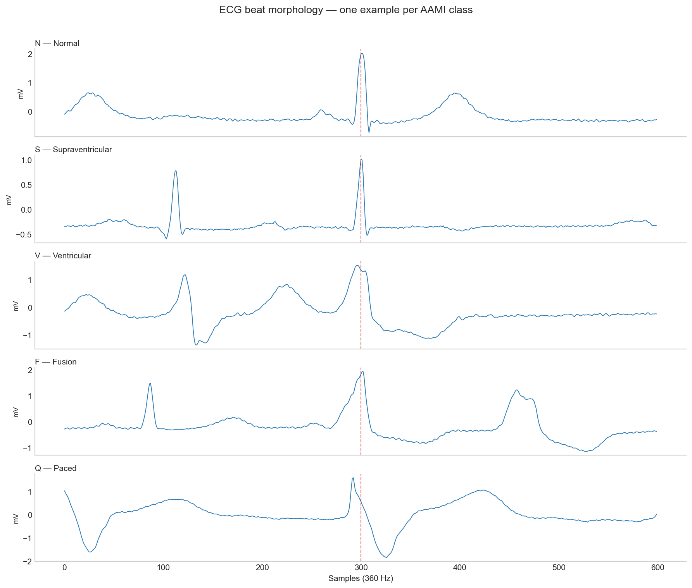
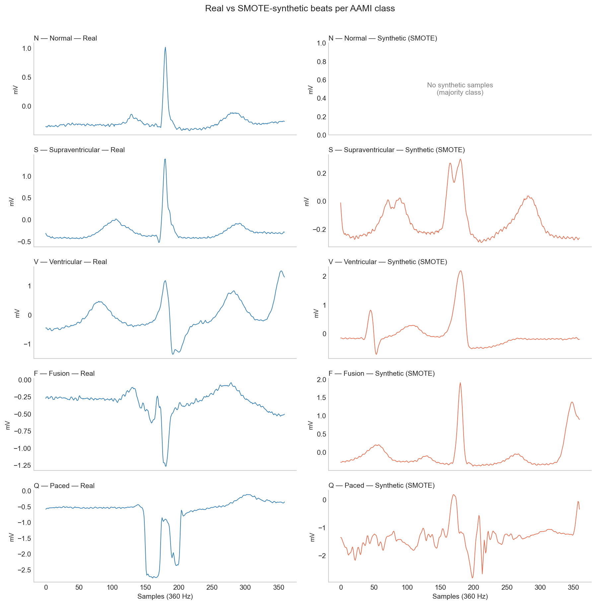

# ecg-arrhythmia-mitbih

ECG arrhythmia classification on MIT-BIH.

> **Blog post:** [coming soon]

## The question

Can a simple 1D CNN reliably detect arrhythmias from single ECG beats?
Short answer: it depends entirely on how you define "reliable" — and accuracy is the wrong metric.

A model that gets 91% accuracy on this dataset is clinically useless. Here's why, and what actually helps.

## Setup

```bash
uv sync
```

## Reproduce

```bash
# 1. Download and preprocess data
uv run python -c "import wfdb; wfdb.dl_database('mitdb', dl_dir='data/raw/')"

# 2. Run notebooks in order
#    01_eda.ipynb
#    02_segmentation.ipynb
#    03_baseline_cnn.ipynb
#    04_weighted_loss.ipynb
#    05_focal_loss.ipynb
#    06_smote.ipynb
#    07_rr_features.ipynb
```

## Results

All models trained on DS1 (22 records), evaluated on DS2 (22 records) — patient-wise split per AAMI EC57 standard. No data leakage.

| Experiment | Accuracy | Macro F1 | S F1 | V F1 | F F1 |
|---|---|---|---|---|---|
| Baseline CNN | 0.91 | 0.29 | 0.01 | 0.51 | 0.00 |
| Weighted CE loss | 0.69 | 0.30 | 0.07 | 0.59 | 0.02 |
| Focal loss (γ=2) | 0.90 | 0.30 | 0.00 | 0.53 | 0.00 |
| SMOTE oversampling | 0.65 | 0.29 | 0.15 | 0.52 | 0.01 |
| CNN + RR features | 0.85 | **0.44** | **0.48** | **0.70** | **0.10** |

## Key finding

Loss function tricks (weighted CE, focal loss) and synthetic oversampling (SMOTE) produced marginal gains. The meaningful improvement came from giving the model what it was actually missing — **timing context**.

RR interval features (pre-RR, post-RR, local ratio) injected alongside CNN embeddings lifted S class F1 from 0.01 to 0.48. Supraventricular beats are premature by definition — no morphology-only model can reliably detect that from a single beat window.

## Figures





## What's next

- Grad-CAM visualization — what is the model attending to?
- CNN + BiLSTM over beat sequences for full rhythm context
- Patient-specific calibration for deployment